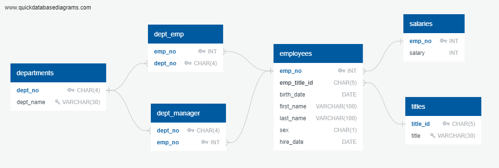

# SQL Challenge - Employee Database: A Mystery in Two Parts

## Where did the data come from?

The database consists of 6 tables imported from 6 csv files provided by Monash University Data Analytics Bootcamp.

## What did I do in this challenge?

1. Inspect the csv files to design an ER diagram using this [tool](http://www.quickdatabasediagrams.com).

   

2. Use the [schema](EmployeeSQL/schema.sql) to create tables in a Postgresql database

3. Import each CSV file into the corresponding SQL table

4. [Query](EmployeeSQL/query.sql) the database to answer the following requirements:

* List the following details of each employee: employee number, last name, first name, sex, and salary.
* List first name, last name, and hire date for employees who were hired in 1986.
* List the manager of each department with the following information: department number, department name, the manager's employee number, last name, first name.
* List the department of each employee with the following information: employee number, last name, first name, and department name.
* List first name, last name, and sex for employees whose first name is "Hercules" and last names begin with "B."
* List all employees in the Sales department, including their employee number, last name, first name, and department name.
* List all employees in the Sales and Development departments, including their employee number, last name, first name, and department name.
* In descending order, list the frequency count of employee last names, i.e., how many employees share each last name.

4. Import the SQL database into Pandas using SQLAlchemy. Use pandas and matplotlib to visualise and analysis the salary data. Please refer to the [notebook](EmployeeSQL/bonus_analysis.ipynb).

---
Contact:

Email: thao.ph.ha@gmail.com
